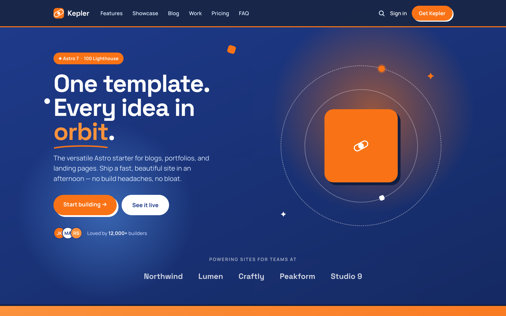
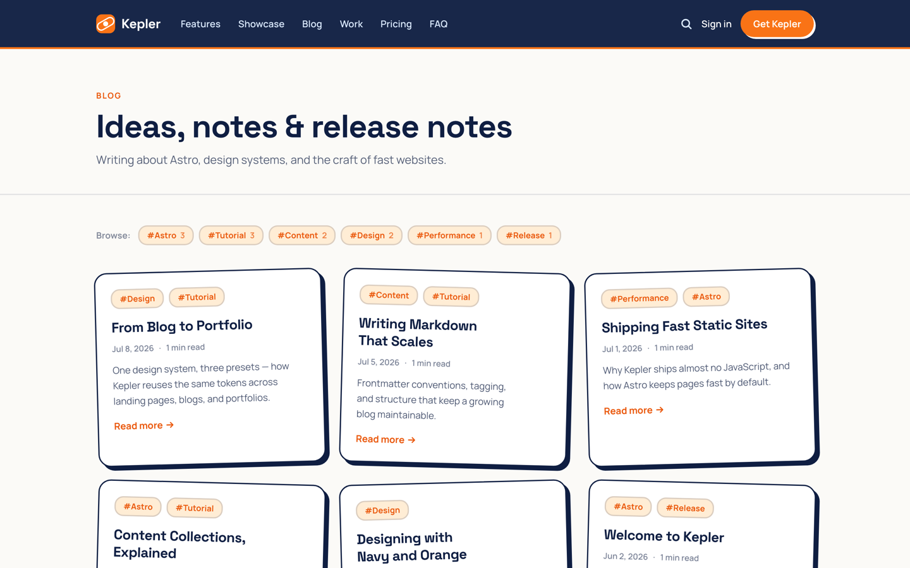
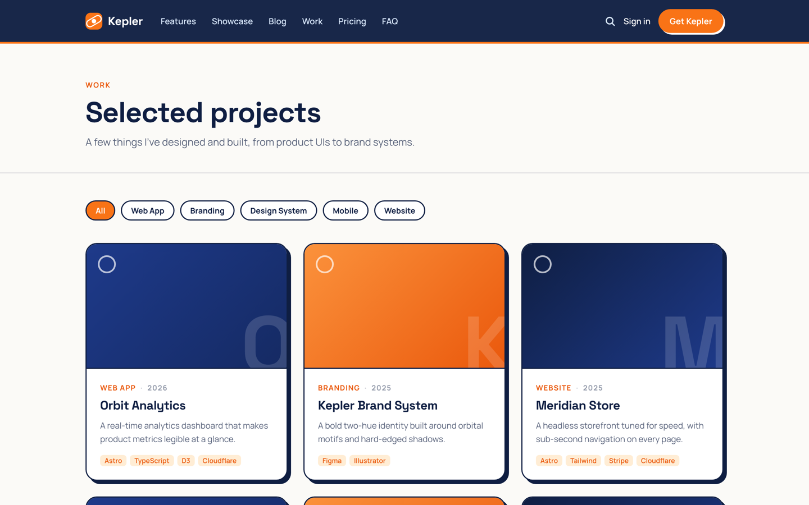
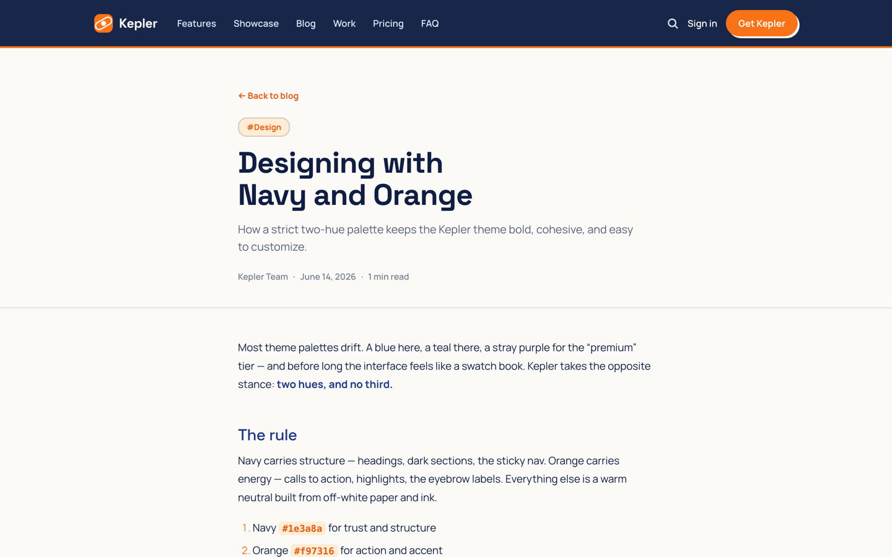
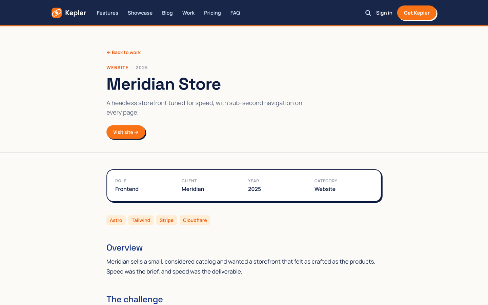

# Kepler

A versatile [Astro 7](https://astro.build) theme for **blogs, portfolios, and landing pages** —
all driven by one cohesive design system. Navy × orange, playful-pop styling with hard
offset shadows and an orbit motif.

[](https://github.com/kpab/astro-kepler/actions/workflows/ci.yml)
[](./LICENSE)
[](https://astro.build)

**Demo:** https://astro-kepler.pages.dev



## Features

- 🚀 **Astro 7 + Tailwind CSS v4 + TypeScript**
- 🛬 **Landing preset** — hero, logo strip, features, showcase, pricing (with toggle),
  testimonials, FAQ accordion, and CTA
- 📝 **Blog preset** — Content Collections (Markdown/MDX), typed frontmatter, tags,
  pagination, reading time, drafts, and RSS
- 🎨 **Portfolio preset** — filterable project grid and case-study layout
- 🔍 **Full-text search** — client-side, zero-backend search powered by [Pagefind](https://pagefind.app)
- 🌐 **SEO baked in** — canonical URLs, Open Graph, Twitter cards, `sitemap.xml`, RSS
- ⚡ **Zero-JS by default** — interactions are a few lines of vanilla `<script>`; no UI framework
- 🎯 **One design system** — two hues, two typefaces, and a set of tokens shared across every preset

## Presets

Three presets, one design system — same tokens, typefaces, and components throughout.

| Blog | Portfolio |
| ---- | --------- |
| [](https://astro-kepler.pages.dev/blog/) | [](https://astro-kepler.pages.dev/work/) |
| Content Collections, tags, pagination, reading time, RSS | Filterable project grid with per-project case studies |

| Article | Case study |
| ------- | ---------- |
| [](https://astro-kepler.pages.dev/blog/designing-with-navy-and-orange/) | [](https://astro-kepler.pages.dev/work/meridian-store/) |
| MDX, Shiki highlighting, prev/next navigation | Meta block, tech tags, long-form case-study body |

Full-text search (`/search`) works across posts and case studies via [Pagefind](https://pagefind.app).

## Tech stack

| Area          | Choice                                    |
| ------------- | ----------------------------------------- |
| Framework     | Astro 7 (`7.0.x`)                         |
| Styling       | Tailwind CSS v4 (`@theme` design tokens)  |
| Language      | TypeScript                                |
| Content       | Content Collections + MDX                 |
| Search        | Pagefind (post-build static index)        |
| Interactivity | Vanilla `<script>`                        |

## Quick start

Click **[Use this template](https://github.com/kpab/astro-kepler/generate)** to create
your own repository from Kepler, then clone it and run:

```sh
pnpm install
pnpm dev        # dev server at http://localhost:4321
pnpm build      # production build to dist/ (also generates the Pagefind index)
pnpm preview    # preview the production build (search works here, not in dev)
```

Then make it yours:

1. Edit **`src/site.config.ts`** — site name, production URL, description, OGP, social handles.
2. Replace the demo content in **`src/content/blog/`** and **`src/content/work/`** with your own.
3. Deploy the `dist/` output to any static host (the demo runs on Cloudflare Pages).

> **Note:** search relies on a static index generated at build time, so it only works
> in `pnpm preview` and in production — not in `pnpm dev`.

## Project structure

```
src/
├─ site.config.ts        # ← edit this first: site name, URL, OGP, social
├─ content.config.ts     # blog & work collection schemas (typed frontmatter)
├─ content/
│  ├─ blog/              # ← your posts (.md / .mdx)
│  └─ work/              # ← your projects (.md / .mdx, case-study body)
├─ pages/                # routing (index = landing page)
│  ├─ blog/              # list (paginated) + [slug] detail
│  ├─ tags/              # all tags + per-tag listing
│  ├─ work/              # grid (filterable) + [slug] case study
│  ├─ search.astro       # Pagefind search UI
│  └─ rss.xml.ts         # RSS feed
├─ layouts/              # BaseLayout, PostLayout, CaseStudyLayout
├─ components/           # Header, Footer, Seo, landing/, blog/, work/
└─ styles/global.css     # Tailwind import + design tokens (@theme) + prose

docs/design/             # design handoff (source of truth — do not edit)
```

## Configuration

Everything a site owner needs to touch lives in **`src/site.config.ts`** — name, production
URL, default description, OGP image, social handles, and posts-per-page. Components read from
it, so there are no hard-coded strings to hunt down.

```ts
export const site = {
  name: 'Kepler',
  url: 'https://your-domain.com', // used for canonical URLs, sitemap, and RSS
  description: '...',
  postsPerPage: 6,
  // ...
};
```

Set the same URL as `site` in `astro.config.mjs` (it imports from `site.config.ts`, so you
only edit one place).

### Design tokens

Colors, fonts, shadows, and radii are defined as CSS variables in the `@theme` block of
`src/styles/global.css`. Rebrand the whole theme by editing two hues:

```css
--color-navy: #1e3a8a; /* structure */
--color-orange: #f97316; /* accent  */
```

## Writing content

Add a Markdown or MDX file to `src/content/blog/` or `src/content/work/`. Frontmatter is
validated against the schema in `content.config.ts`, so typos fail the build instead of
shipping broken pages.

**Blog post** (`src/content/blog/my-post.md`):

```yaml
---
title: 'My Post'
description: 'One sentence that would make you click.'
pubDate: 2026-07-11
tags: ['Astro', 'Tutorial']
author: 'Your Name' # optional; falls back to site.author
draft: false # true → excluded from the production build
---
```

**Project** (`src/content/work/my-project.md`):

```yaml
---
title: 'My Project'
description: 'Short summary.'
category: 'Web App' # used for the filter
tech: ['Astro', 'TypeScript']
year: 2026
role: 'Design & Frontend' # optional
url: 'https://example.com' # optional
repo: 'https://github.com/...' # optional
order: 1 # sort order (lower first)
---
```

The body of a project file becomes its case study.

## Deployment (Cloudflare Pages)

The demo deploys to Cloudflare Pages. Any static host works — just point it at the build:

- **Build command:** `pnpm build`
- **Output directory:** `dist`

`pnpm build` runs `astro build` followed by `pagefind --site dist`, so the search index
ships with your site automatically.

## License

[MIT](./LICENSE) — free to use, fork, and adapt.
